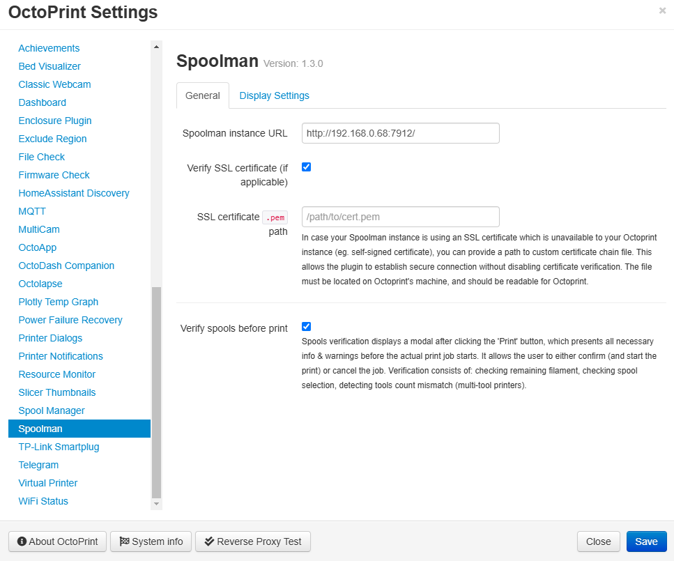

# Prusa Print Docker Structure

## Summary

For Prusaprint, the setupOctoprint.sh should be called and the following docker stacks are enabled:

- utils
- networking

## Setup Octoprint

As for setting up Octoprint, the script setupOctoprint.sh will need to be run along the extra installs section of this ReadMe.md

### Restoring Backup and Plugins

You will also need to reinstall the plugins. This is done through the Octoprint plugin manager UI and the following files:

- plugin_list.json

Simply upload it and it will do the rest of installing them.

### Extra Installs

#### Docker

Required for the rest of the home lab network, will need to install docker engine and then run the docker compose.
You will need to install it using the following [instructions](https://docs.docker.com/engine/install/raspberry-pi-os/)

Once this is done you can then do the following:

```bash

bash docker-compose.sh --up # Bring up Stack
bash docker-compose.sh --up # Bring down Stack
```

#### LED Strip Controller

Required for turning off and on the lights, you will have to enter the following into scripts outputs of the enclosure plugin

Turn On the Lights

```bash
~/LED-Strip-Controller-Octoprint/scripts/TurnOnLights.sh
```

Turn off the Lights

```bash
~/LED-Strip-Controller-Octoprint/scripts/TurnOffLights.sh
```

#### Setup DHT11 Sensor

To setup the Enclosure Temp and Humidity Sensor you will have to set up the Enclosure plugin for input using the following configuration:

```bash
sudo apt install libgpiod2
python3 -m pip install adafruit-circuitpython-dht
```

You should then be able to run the following [script](./testDHT11.py)

#### Telegram

When setting up the Telegram plugin, you will have to set up the botfather token and thent talk to the bot, to enable all the features.

You will also need to add the following to before and after the camera takes a photo:

Turn On the Lights

```bash
~/LED-Strip-Controller-Octoprint/scripts/TurnOnLights.sh
```

Turn off the Lights

```bash
~/LED-Strip-Controller-Octoprint/scripts/TurnOffLights.sh
```

This is so that the images are actually seeable in the dark.

##### Potential Issues

When setting up the telegram plugin, I had issues where i could not have the multicam plugin enabled at the same time. This meant that the status plugin command didnt work.

#### Octolapse

The scripts within octolapse have to be from the root level and cant use `~`, thus the scripts are as follows:

```bash
/home/pi/LED-Strip-Controller-Octoprint/scripts/TurnOffLights.sh

/home/pi/LED-Strip-Controller-Octoprint/scripts/TurnOnLights.sh
```


#### Spoolman



#### Octodash

As for extra installs, Octodash cant be installed using the plugin manager and the following command must be used:

```bash
bash <(wget -qO- https://github.com/UnchartedBull/OctoDash/raw/main/scripts/install.sh)
```

## Useful Links

- [OctoDash](https://github.com/UnchartedBull/OctoDash/wiki/Installation)
- [Camera Module V3 Autofocus Settings](https://community.octoprint.org/t/manual-raspi-camera-v3-webcam-auto-focus/53025)
- [DHT11 Not showing up on GUI](https://github.com/vitormhenrique/OctoPrint-Enclosure/issues/435)
- [DHT11 Setup](https://pimylifeup.com/raspberry-pi-dht11-sensor/)
